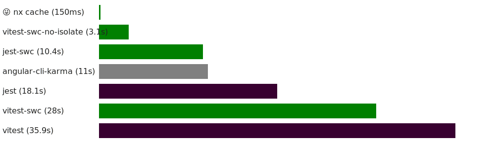

# ⚡️ Speed Up Angular Testing with SWC 🦀

<!-- TOC -->

- [⚡️ Speed Up Angular Testing with SWC 🦀](#️-speed-up-angular-testing-with-swc-)
  - [👀 What is this?](#-what-is-this)
  - [🤔 Context](#-context)
  - [🥇 Benchmark Summary](#-benchmark-summary)
  - [🎭 Setup with Jest](#-setup-with-jest)
    - [1. Install](#1-install)
    - [2. Configure](#2-configure)
    - [3. Add `reflect-metadata`](#3-add-reflect-metadata)
  - [⚡️Setup with Vitest](#️setup-with-vitest)
    - [1. Install](#1-install-1)
    - [2. Configure](#2-configure-1)
    - [3. Add `reflect-metadata`](#3-add-reflect-metadata-1)
  - [🙋‍♂️ F.A.Q.](#️-faq)
    - [TypeScript property inheritance issue](#typescript-property-inheritance-issue)
  - [🥇 Benchmark Data](#-benchmark-data)
    - [🔥 No Cache](#-no-cache)
    - [⚡️ With Cache](#️-with-cache)
    - [🥱 Cold Start](#-cold-start)
    - [Configurations](#configurations)
    - [Source](#source)

<!-- TOC -->

## 👀 What is this?

This is a set of Angular presets that enable you to use [SWC (Speedy Web Compiler)](https://swc.rs/) with Jest or
Vitest.

**Switching to SWC can speed up your tests by 2x to 12x.**

## 🤔 Context

Surprisingly, in most cases, the bottleneck in Jest & Vitest tests is not the test execution time nor the Angular JIT
(Just-In-Time) compiler but the TypeScript transformer.

This is where SWC (Speedy Web Compiler) comes in. SWC is a JavaScript/TypeScript compiler that aims to be extremely
fast.

This package enables you to use SWC with Angular projects by setting the right configuration for SWC and using
our Angular plugin for SWC [`@jscutlery/swc-angular-plugin`](../swc-angular-plugin)

## 🥇 Benchmark Summary



_This chart is based on the [benchmark where all caches were disabled](#-no-cache) as in most cases we will still have
to transform the code that we changed and which is affecting our tests._
_In addition to that, incremental build tools like [Nx](https://nx.dev) (or jest/vitest `changedSince`/`changed`
options) will reduce the amount of transforms._

_Cf. [Detailed Benchmark Data](#-no-cache)_

## 🎭 Setup with Jest

### 1. Install

Install this preset and its dependencies via npm:

```sh
npm install -D @jscutlery/swc-angular @jscutlery/swc-angular-plugin @swc/core @swc/jest
grep .swc .gitignore || echo .swc >> .gitignore
```

### 2. Configure

In your Jest configuration file (e.g., `jest.config.ts`), use the `swcAngularJestTransformer` function to
transform `.ts`, `.js`, and `.mjs` files.

```js
import { swcAngularJestTransformer } from '@jscutlery/swc-angular';

export default {
  // ...
  transform: {
    '^.+\\.(ts|mjs|js)$': swcAngularJestTransformer(),
    '^.+\\.(html)$': [
      'jest-preset-angular',
      {
        tsconfig: '<rootDir>/tsconfig.spec.json',
        stringifyContentPathRegex: '\\.(html|svg)$',
      },
    ],
  },
  transformIgnorePatterns: ['node_modules/(?!.*\\.mjs$)'],
  // ...
};
```

### 3. Add `reflect-metadata`

In order for constructor injection to work, you need to import `reflect-metadata` in the setup file which is probably
located at `src/test-setup.ts`.

```ts
import 'reflect-metadata';
```

## ⚡️Setup with Vitest

### 1. Install

Install this preset and its dependencies via npm:

```sh
npm install -D @jscutlery/swc-angular @jscutlery/swc-angular-plugin @swc/core unplugin-swc
grep .swc .gitignore || echo .swc >> .gitignore
```

### 2. Configure

In your vite configuration file (e.g., `vite.config.ts`), use the `unplugin-swc` plugin with our
preset: `swcAngularVitePreset`.

```js
import { swcAngularUnpluginOptions } from '@jscutlery/swc-angular';
import swc from 'unplugin-swc';
import { defineConfig } from 'vite';

export default defineConfig({
  // ...
  plugins: [swc.vite(swcAngularUnpluginOptions())],
  // ...
});
```

### 3. Add `reflect-metadata`

In order for constructor injection to work, you need to import `reflect-metadata` in the setup file which is probably
located at `src/test-setup.ts`.

```ts
import 'reflect-metadata';
```

## 🙋‍♂️ F.A.Q.

### TypeScript property inheritance issue

If you encounter an issue with TypeScript property inheritance _(Cf. https://github.com/jscutlery/devkit/issues/376)_, then you can try to disable the `useDefineForClassFields` option:

```ts
swcAngularJestTransformer({ useDefineForClassFields: false });
```

or

```ts
swcAngularUnpluginOptions({ useDefineForClassFields: false });
```

_🙏 Thanks to [@santiagof4](https://github.com/santiagof4), [@pumano](https://github.com/pumano), and [@ryan-bendel](https://github.com/ryan-bendel)._

## 🥇 Benchmark Data

### 🔥 No Cache

All caches are cleared before each benchmark run.

| Configuration                 |     Relative |       Mean [s] | Min [s] | Max [s] |
| :---------------------------- | -----------: | -------------: | ------: | ------: |
| 🥇`vitest-swc-no-isolate`     |         1.00 |  3.137 ± 0.061 |   3.042 |   3.227 |
| 🥈`jest-swc`                  |  3.31 ± 0.15 | 10.393 ± 0.429 |   9.745 |  10.994 |
| 🥉`angular-cli-karma`         |  3.52 ± 0.53 | 11.041 ± 1.642 |  10.218 |  15.690 |
| `angular-cli-web-test-runner` |  5.46 ± 0.45 | 17.118 ± 1.362 |  16.473 |  20.911 |
| `jest`                        |  5.78 ± 0.25 | 18.132 ± 0.716 |  17.553 |  19.998 |
| `angular-cli-jest`            |  8.61 ± 0.63 | 27.009 ± 1.902 |  24.938 |  30.450 |
| `vitest-swc`                  |  8.94 ± 0.21 | 28.038 ± 0.402 |  27.539 |  28.617 |
| `vitest`                      | 11.43 ± 0.32 | 35.872 ± 0.727 |  34.452 |  37.340 |
| `vitest-no-isolate`           | 11.49 ± 0.25 | 36.061 ± 0.369 |  35.414 |  36.502 |

### ⚡️ With Cache

All tests are ran once to warm up the cache before running the benchmark.

| Configuration                 |     Relative |       Mean [s] | Min [s] | Max [s] |
| :---------------------------- | -----------: | -------------: | ------: | ------: |
| 🥇`vitest-swc-no-isolate`     |         1.00 |  3.092 ± 0.090 |   3.030 |   3.301 |
| 🥈`angular-cli-karma`         |  1.91 ± 0.07 |  5.901 ± 0.139 |   5.718 |   6.131 |
| 🥉`jest-swc`                  |  2.93 ± 0.18 |  9.045 ± 0.494 |   8.513 |  10.065 |
| `jest`                        |  4.07 ± 0.25 | 12.581 ± 0.663 |  11.572 |  13.915 |
| `angular-cli-web-test-runner` |  5.96 ± 0.29 | 18.428 ± 0.711 |  17.497 |  19.262 |
| `angular-cli-jest`            |  8.46 ± 1.04 | 26.170 ± 3.117 |  23.350 |  31.983 |
| `vitest-swc`                  |  9.28 ± 0.36 | 28.691 ± 0.728 |  27.977 |  30.488 |
| `vitest-no-isolate`           | 11.74 ± 0.45 | 36.286 ± 0.880 |  35.107 |  38.018 |
| `vitest`                      | 12.18 ± 0.63 | 37.666 ± 1.625 |  35.563 |  41.503 |

- _Note that, as of
  today, [vitest doesn't cache transformed files](https://vitest.dev/config/#cache:~:text=At%20the%20moment%20Vitest%20stores%20cache%20for%20test%20results%20to%20run%20the%20longer%20and%20failed%20tests%20first)._

### 🥱 Cold Start

Run a single test module just and try to measure the bootstrap time.

| Configuration                 |    Relative |      Mean [s] | Min [s] | Max [s] |
| :---------------------------- | ----------: | ------------: | ------: | ------: |
| 🥇`vitest-swc-no-isolate`     |        1.00 | 1.260 ± 0.024 |   1.241 |   1.314 |
| 🥈`vitest-swc`                | 1.00 ± 0.03 | 1.262 ± 0.026 |   1.225 |   1.305 |
| 🥉`jest-swc`                  | 1.44 ± 0.15 | 1.812 ± 0.186 |   1.714 |   2.310 |
| `vitest-no-isolate`           | 1.47 ± 0.05 | 1.846 ± 0.056 |   1.797 |   1.949 |
| `vitest`                      | 1.61 ± 0.16 | 2.030 ± 0.198 |   1.814 |   2.423 |
| `jest`                        | 1.69 ± 0.08 | 2.136 ± 0.094 |   2.017 |   2.356 |
| `angular-cli-jest`            | 1.73 ± 0.39 | 2.186 ± 0.495 |   1.869 |   3.119 |
| `angular-cli-web-test-runner` | 2.06 ± 1.15 | 2.602 ± 1.451 |   2.080 |   6.730 |
| `angular-cli-karma`           | 5.08 ± 1.30 | 6.400 ± 1.636 |   5.377 |  10.177 |

### Configurations

|                               | Configuration                  | Test Isolation\* |
| ----------------------------- | :----------------------------- | ---------------: |
| `angular-cli-karma`           | Angular CLI's Karma            |            false |
| `angular-cli-jest`            | Angular CLI's Jest             |             true |
| `angular-cli-web-test-runner` | Angular CLI's @web/test-runner |             true |
| `jest`                        | Jest                           |             true |
| `jest-swc`                    | Jest + SWC                     |             true |
| `vitest`                      | Vitest                         |             true |
| `vitest-no-isolate`           | Vitest + No Isolation          |            false |
| `vitest-swc`                  | Vitest + SWC                   |             true |
| `vitest-swc-no-isolate`       | Vitest + SWC + No Isolation    |            false |

- _Test Isolation: this tells whether each test module has its own testing environment or if each one is isolated. (i.e.
  globals like the DOM are shared, asynchronous code might bleed between tests, etc...)_

### Source

💻 try it yourself: https://github.com/yjaaidi/experiments/tree/angular-swc-benchmark
or checkout the last benchmark results: https://github.com/yjaaidi/experiments/actions/workflows/benchmark.yml
